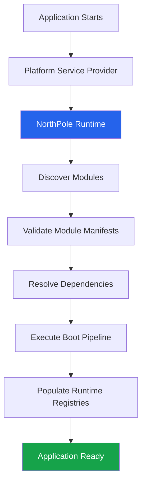
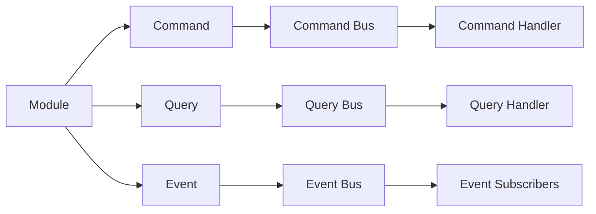
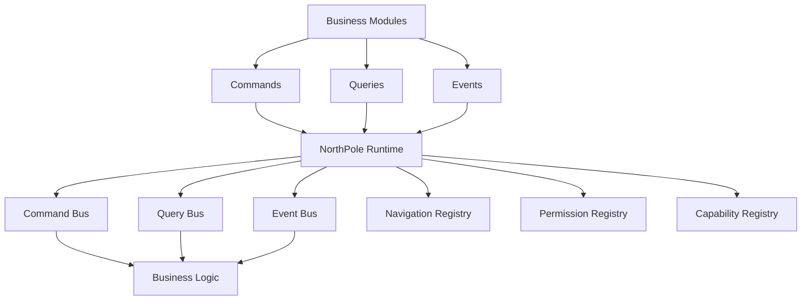

# NorthPole

> **A modular application platform for Laravel, built around a deterministic Runtime.**

NorthPole is an open-source platform for building large-scale, modular business applications on Laravel.

At its core is the **NorthPole Runtime**, a deterministic orchestration engine responsible for discovering modules, validating dependencies, coordinating startup and exposing platform services. Rather than treating modules as simple folders of code, NorthPole treats them as first-class platform components with clearly defined contracts and responsibilities.

Every module declares what it provides and what it requires. During application startup, the Runtime discovers these declarations, validates them, resolves dependencies and executes a predictable boot sequence. This creates a platform that is observable, testable and maintainable, regardless of how many modules are installed.

NorthPole is designed for developers building complex business systems where long-term maintainability is as important as delivering features.

---

## Why NorthPole?

Business applications rarely stay small.

A customer management system becomes an ERP. A simple booking application evolves into a complete business platform. New modules are added, new developers join the team, and over time the architecture becomes increasingly difficult to understand.

Traditional modular approaches often focus on separating code into directories or packages. While this improves organisation, they do not solve the deeper challenges of dependency management, predictable startup, module communication or platform-wide discoverability.

NorthPole addresses these challenges by separating **platform infrastructure** from **business functionality**.

The Runtime is responsible for:

- Discovering installed modules
- Validating module manifests
- Resolving dependencies
- Executing the Boot Pipeline
- Registering platform services
- Coordinating communication between modules

Modules remain focused solely on the business capabilities they provide.

This clear separation allows applications to grow without sacrificing architectural consistency or maintainability.


## Core Features

NorthPole provides a deterministic Runtime and a collection of platform services that allow independent modules to work together without becoming tightly coupled.

### Deterministic Runtime

Every application starts using the same predictable lifecycle.

The Runtime discovers modules, validates manifests, resolves dependencies and executes the Boot Pipeline in a consistent order, making startup reliable and repeatable.

### Automatic Module Discovery

Modules are discovered automatically.

There is no central registration file to maintain. Installing a module makes it available to the Runtime, which validates and loads it during startup.

### Dependency Resolution

Modules explicitly declare their dependencies.

The Runtime validates these dependencies before the application boots, preventing invalid configurations and making dependency issues immediately visible.

### Boot Pipeline

The Boot Pipeline is responsible for coordinating platform startup.

Each stage has a single responsibility and executes in a deterministic sequence, ensuring every Runtime service is registered consistently.

### Command Bus

The Command Bus executes business actions.

Each command is handled by a single Command Handler, providing a clear separation between requests and implementation.

### Query Bus

The Query Bus retrieves information without modifying application state.

Every query is processed by a dedicated Query Handler, encouraging clear separation between reading and writing operations.

### Event Bus

The Event Bus enables loosely coupled communication between modules.

Modules publish events describing something that has already happened. Other modules may subscribe and react without introducing direct dependencies.

### Runtime Registries

NorthPole includes dedicated registries for platform-wide services, including:

- Navigation
- Permissions
- Capabilities

These registries provide a central source of truth for Runtime-managed resources.

### Built-in Diagnostics

The Runtime exposes diagnostic information about installed modules, dependencies and platform services, making it easier to inspect and troubleshoot the application.


## Architecture

NorthPole is built around a deterministic Runtime that coordinates every stage of application startup.

Rather than allowing modules to bootstrap themselves independently, the Runtime discovers every installed module, validates its manifest, resolves dependencies and executes a predictable Boot Pipeline.

The result is a platform that starts the same way every time.



The Runtime is responsible for infrastructure.

Modules are responsible for business functionality.

This separation keeps the platform modular, predictable and easier to maintain as applications grow.


## Runtime Components

The Runtime is composed of a number of focused services, each with a single responsibility.

| Component | Responsibility |
|-----------|----------------|
| Runtime | Coordinates platform startup and orchestration |
| Module Discovery | Finds installed modules automatically |
| Manifest Validation | Validates every module manifest before boot |
| Dependency Resolver | Ensures module dependencies are satisfied |
| Boot Pipeline | Executes Runtime stages in a deterministic order |
| Command Bus | Routes commands to their registered handlers |
| Query Bus | Routes queries to their registered handlers |
| Event Bus | Publishes events to registered subscribers |
| Navigation Registry | Collects navigation contributed by modules |
| Permission Registry | Collects permissions declared by modules |
| Capability Registry | Collects platform capabilities exposed by modules |
| Runtime Diagnostics | Provides inspection and health information |

Each component has one clearly defined responsibility.

Together they provide the infrastructure required to build large, modular business applications while keeping individual modules independent and focused on business functionality.


## Core Concepts

NorthPole is built around four fundamental concepts. Together they define how modules communicate while remaining independent.

### Modules

A module is a self-contained unit of business functionality.

Each module owns its own models, controllers, routes, commands, queries, events, views and configuration. Modules communicate through the Runtime rather than directly with one another, allowing them to evolve independently.

Examples include:

- CRM
- Inventory
- Billing
- Human Resources
- SantaBuddy

---

### Commands

Commands represent an intention to perform work.

A command changes the state of the application and is always handled by a single Command Handler.

Examples:

- CreateCustomer
- UpdateInvoice
- AssignRole
- SendWelcomeEmail

---

### Queries

Queries request information.

Unlike Commands, Queries never modify application state. They are handled by a dedicated Query Handler responsible for retrieving the requested data.

Examples:

- FindCustomer
- GetInvoice
- SearchOrders
- DashboardStatistics

---

### Events

Events announce that something has already happened.

Modules publish events without knowing which other modules may respond. This creates a loosely coupled architecture where new functionality can be added without modifying existing modules.

Examples:

- CustomerCreated
- InvoicePaid
- UserRegistered
- ModuleInstalled

---

### How They Work Together



This architecture keeps business functionality isolated while allowing modules to communicate through well-defined Runtime services.


## Getting Started

NorthPole has been designed to make building modular business applications predictable and maintainable.

The recommended learning path is:

1. Understand the Runtime.
2. Learn how modules are structured.
3. Explore Commands, Queries and Events.
4. Build your first module.
5. Extend the platform using Runtime services.

### Prerequisites

Before getting started, ensure you have:

- PHP 8.3 or later
- Composer
- Laravel
- A supported database
- Git

### Clone the Repository

```bash
git clone https://github.com/<organisation>/northpole.git

cd northpole

composer install
```

### Run the Application

```bash
php artisan serve
```

### Run the Test Suite

NorthPole is developed using automated tests to ensure platform stability.

```bash
php artisan test
```

Every contribution should maintain a passing test suite.

### Create Your First Module

Once the platform is running, begin by creating a simple module.

A dedicated module generator and Developer SDK are planned as part of the NorthPole roadmap. Until then, the documentation provides guidance on creating modules manually.

For detailed guidance, continue with the documentation below.


## Documentation

Comprehensive documentation is available in the **docs** directory.

| Document | Description |
|----------|-------------|
| README | Project overview and introduction |
| docs/README.md | Documentation index |
| docs/01-platform-overview.md | High-level platform architecture |
| docs/02-runtime.md | The NorthPole Runtime |
| docs/03-module-development.md | Building and structuring modules |
| docs/04-command-bus.md | Command architecture |
| docs/05-query-bus.md | Query architecture |
| docs/06-event-bus.md | Event architecture |
| docs/07-capability-system.md | Capability Registry |
| docs/08-navigation.md | Navigation Registry |
| docs/09-permission-system.md | Permission Registry |
| docs/10-runtime-lifecycle.md | Runtime startup lifecycle |
| docs/11-engineering-handbook.md | Engineering standards |
| docs/12-roadmap.md | Platform roadmap |

If you're new to NorthPole, we recommend reading the documentation in numerical order. Each guide builds upon the concepts introduced in the previous one, taking you from the platform overview through to the Runtime, module development and engineering practices.


## Current Platform Status

NorthPole is under active development and already provides a solid foundation for building modular business applications.

### Implemented

The Runtime currently includes the following capabilities:

- ✅ Deterministic Runtime
- ✅ Automatic Module Discovery
- ✅ Module Manifest Validation
- ✅ Dependency Resolution
- ✅ Boot Pipeline
- ✅ Command Bus
- ✅ Query Bus
- ✅ Event Bus
- ✅ Navigation Registry
- ✅ Permission Registry
- ✅ Capability Registry
- ✅ Runtime Diagnostics
- ✅ Comprehensive Automated Test Suite

### Platform Goals

The current focus is on strengthening the Runtime and developer experience before expanding the ecosystem.

Immediate priorities include:

- Completing the Developer SDK
- Enhancing Runtime diagnostics
- Improving documentation
- Expanding module tooling
- Preparing for the Module Marketplace

### Design Philosophy

NorthPole prioritises:

- Long-term maintainability over short-term convenience.
- Clear architecture over hidden complexity.
- Explicit communication over tight coupling.
- Predictable behaviour over implicit magic.
- High test coverage and comprehensive documentation.

Every feature added to the platform should reinforce these principles.


## Roadmap

NorthPole is being developed incrementally, with each release building upon a stable and well-tested Runtime foundation.

The roadmap is driven by architectural goals rather than fixed delivery dates.

### Near-Term Objectives

The next planned enhancements include:

- Developer SDK
- Runtime Inspector
- Enhanced Runtime Diagnostics
- Improved Module Tooling
- Module Marketplace
- Expanded Documentation

### Long-Term Vision

As the platform evolves, NorthPole will continue to focus on:

- Modular application development
- Deterministic Runtime execution
- Independent business modules
- Rich developer tooling
- Runtime observability
- Platform extensibility

Every new capability will be evaluated against the same engineering principles that shaped the Runtime:

- Simplicity
- Maintainability
- Predictability
- Testability
- Clear architecture

NorthPole will continue to evolve, but these principles will remain constant.


## Contributing

Contributions are welcome and encouraged.

NorthPole is built around a clear architectural philosophy, and every contribution should strengthen that philosophy rather than compromise it.

Before submitting a contribution, please ensure that you:

- Follow the established project structure.
- Keep modules independent and loosely coupled.
- Maintain single responsibility within classes and services.
- Write or update automated tests where appropriate.
- Update documentation when behaviour changes.
- Follow the engineering standards described in the Engineering Handbook.

### Pull Requests

A good pull request should:

- Solve one clearly defined problem.
- Include appropriate automated tests.
- Preserve backwards compatibility where possible.
- Include documentation updates if required.
- Be small enough to review comfortably.

### Reporting Issues

If you discover a bug or have a feature suggestion, please open an issue describing:

- The problem.
- Steps to reproduce it.
- Expected behaviour.
- Actual behaviour.
- Any relevant logs or screenshots.

Constructive discussion and well-documented issues help make NorthPole better for everyone.

### Engineering First

NorthPole values thoughtful engineering over rapid feature growth.

If you are unsure about an architectural decision, start a discussion before implementing a significant change. Collaboration almost always produces a better long-term outcome.


## Licence

NorthPole is released under the MIT License.

You are free to use, modify and distribute the software in accordance with the terms of the licence.

See the `LICENSE` file for the complete licence text.

---

## Acknowledgements

NorthPole has been developed with a strong emphasis on software architecture, maintainability and long-term thinking.

The platform draws inspiration from proven engineering principles while remaining focused on solving the practical challenges of building modular business applications on Laravel.

Every design decision aims to leave the platform more understandable, more predictable and easier to evolve.

---

## Final Thoughts

NorthPole is more than a collection of modules.

It is a platform designed to help developers build software that remains understandable as it grows.

By separating infrastructure from business functionality and favouring explicit architecture over hidden complexity, NorthPole provides a foundation for applications that can evolve with confidence.

Whether you are building your first module or maintaining a platform with hundreds of them, the same engineering principles apply:

- Build with clarity.
- Test thoroughly.
- Document continuously.
- Keep modules independent.
- Leave the platform better than you found it.

---

> **NorthPole isn't built to make software easier to write. It's built to make software easier to understand, maintain and evolve.**


## Table of Contents

- [What is NorthPole?](#what-is-northpole)
- [Why NorthPole?](#why-northpole)
- [Core Features](#core-features)
- [Architecture](#architecture)
- [Runtime Components](#runtime-components)
- [Core Concepts](#core-concepts)
- [Getting Started](#getting-started)
- [Documentation](#documentation)
- [Current Platform Status](#current-platform-status)
- [Roadmap](#roadmap)
- [Contributing](#contributing)
- [Licence](#licence)


## Platform Architecture

NorthPole is organised into distinct architectural layers, each with a clearly defined responsibility.



Each layer has a single responsibility.

### Business Modules

Business modules contain domain logic only.

Examples include CRM, Inventory, Billing, Human Resources and SantaBuddy.

Modules never communicate directly with one another.

---

### Runtime

The Runtime is the orchestration layer.

It discovers modules, validates manifests, resolves dependencies and coordinates the platform startup lifecycle.

The Runtime owns infrastructure, not business logic.

---

### Buses

Commands, Queries and Events provide explicit communication between modules.

Rather than introducing direct dependencies, modules communicate through dedicated Runtime services.

This keeps modules independent and easier to maintain.

---

### Registries

Registries maintain platform-wide information contributed by modules.

These currently include:

- Navigation
- Permissions
- Capabilities

Because every module contributes through the Runtime, the platform always has a complete and consistent view of available functionality.


## Design Principles

NorthPole has been designed around a small number of engineering principles that guide every architectural decision.

### Deterministic by Design

Given the same modules and configuration, the Runtime always produces the same result. Startup order, dependency resolution and registration are predictable and repeatable.

### Convention Where It Helps

Modules follow clear conventions for manifests, registration and lifecycle hooks. This reduces configuration while keeping behaviour explicit.

### Explicit Over Implicit

Communication between modules occurs through well-defined Commands, Queries and Events rather than hidden dependencies or tightly coupled service calls.

### Independent Modules

Each module owns its own business logic, configuration, migrations, routes and assets. Modules should remain self-contained and reusable wherever practical.

### Testability First

Every Runtime component is designed to be independently testable. Automated tests verify platform behaviour and help ensure confidence when introducing new features.

### Open for Extension

New Runtime stages, registries, buses and modules can be added without modifying existing components, allowing the platform to evolve while preserving stability.


## Why NorthPole?

Modern business applications often begin as clean, well-structured projects but gradually become difficult to maintain as new features are added. Business logic spreads across the application, modules become tightly coupled, and understanding the impact of a change becomes increasingly challenging.

NorthPole was created to address these problems through a Runtime-driven architecture.

Rather than allowing modules to interact directly, NorthPole provides a consistent Runtime that discovers modules, validates their manifests, resolves dependencies and coordinates communication through dedicated infrastructure.

This approach delivers several key benefits:

- Predictable application startup.
- Independent, self-contained business modules.
- Explicit communication through Commands, Queries and Events.
- Centralised registration of navigation, permissions and capabilities.
- A platform that becomes easier to extend without becoming harder to understand.

NorthPole is designed for long-lived business systems where maintainability, clarity and deterministic behaviour are valued as highly as rapid feature delivery.

Whether supporting a handful of modules or hundreds, the same architectural principles continue to apply.


## Example Module

A NorthPole module is a self-contained unit of business functionality.

Each module owns its own resources and communicates with the wider platform through Runtime services.

A typical module structure looks like this:

```text
modules/

CRM/

├── Commands/
├── Queries/
├── Events/
├── Listeners/
├── Http/
│   ├── Controllers/
│   └── Requests/
├── Database/
│   ├── Migrations/
│   └── Seeders/
├── Models/
├── Providers/
├── Resources/
├── Routes/
├── Tests/
├── Config/
├── module.json
└── README.md
```

### Module Manifest

Every module contains a `module.json` file.

The manifest describes the module to the Runtime, including:

- Module name
- Version
- Dependencies
- Service providers
- Commands
- Queries
- Events
- Permissions
- Navigation
- Capabilities

Example:

```json
{
    "name": "CRM",
    "version": "1.0.0",
    "dependencies": [],
    "commands": [],
    "queries": [],
    "events": []
}
```

The Runtime reads this information during startup and registers the module automatically.

### Module Responsibilities

A module should contain:

- Business rules
- Domain models
- User-facing functionality
- Module-specific configuration
- Automated tests

A module should not contain:

- Runtime orchestration
- Platform infrastructure
- Hidden dependencies on other modules

Keeping these boundaries clear allows modules to evolve independently.


## Current Platform Status

NorthPole is actively evolving, with the core Runtime architecture already established and tested.

### Runtime Foundation

Implemented:

- ✅ Deterministic Runtime
- ✅ Module Discovery
- ✅ Module Manifest Validation
- ✅ Dependency Resolution
- ✅ Boot Pipeline
- ✅ Lifecycle Management

### Communication Layer

Implemented:

- ✅ Command Bus
- ✅ Query Bus
- ✅ Event Bus
- ✅ Command Registration
- ✅ Query Registration
- ✅ Event Subscriber Registration

### Platform Registries

Implemented:

- ✅ Navigation Registry
- ✅ Permission Registry
- ✅ Capability Registry
- ✅ Runtime Diagnostics

### Quality

The platform is developed with a strong focus on reliability:

- Automated test coverage across Runtime components.
- Explicit contracts between platform services.
- Clear separation between infrastructure and business modules.
- Documentation maintained alongside implementation.

The current focus is improving developer experience, module tooling and platform visibility.


## Current Platform Status

NorthPole is under active development with a stable Runtime foundation already in place.

The project is following a test-first engineering approach, with every Runtime capability backed by automated tests before new functionality is introduced.

### Runtime Foundation

Implemented:

- ✅ Deterministic Runtime boot pipeline
- ✅ Module discovery
- ✅ Manifest loading and validation
- ✅ Dependency resolution
- ✅ Runtime lifecycle orchestration
- ✅ Runtime diagnostics

### Communication Layer

Implemented:

- ✅ Command Bus
- ✅ Query Bus
- ✅ Event Bus
- ✅ Command registration
- ✅ Query registration
- ✅ Event subscriber registration

### Runtime Registries

Implemented:

- ✅ Configuration Registry
- ✅ Navigation Registry
- ✅ Permission Registry
- ✅ Capability Registry
- ✅ Notification Registry
- ✅ Scheduled Job Registry

### Module Lifecycle

Implemented:

- ✅ Install
- ✅ Enable
- ✅ Disable
- ✅ Uninstall
- ✅ Runtime validation
- ✅ Tenant-aware module management

### Platform APIs

Implemented:

- ✅ Marketplace API
- ✅ Organisation API
- ✅ Runtime metadata endpoints
- ✅ Tenant-aware module installation

### Engineering Quality

NorthPole places engineering quality ahead of rapid feature growth.

Current priorities include:

- High automated test coverage.
- Explicit Runtime contracts.
- Predictable module boundaries.
- Comprehensive documentation.
- Backwards-compatible Runtime evolution.

The next phase of development focuses on developer tooling, SDK improvements, Marketplace capabilities and production readiness.


## Roadmap

NorthPole is being developed in carefully planned phases. Each phase builds upon the previous one while maintaining full backwards compatibility and comprehensive automated testing.

### Phase 1 - Runtime Foundation (Completed)

- ✅ Modular Runtime architecture
- ✅ Runtime boot pipeline
- ✅ Module discovery
- ✅ Manifest validation
- ✅ Dependency resolution
- ✅ Runtime registries
- ✅ Command Bus
- ✅ Query Bus
- ✅ Event Bus
- ✅ Tenant-aware module lifecycle
- ✅ Marketplace API
- ✅ Organisation management
- ✅ Runtime diagnostics
- ✅ Runtime metadata API

### Phase 2 - Developer Experience (In Progress)

Current priorities include:

- Improved module scaffolding
- Additional Artisan tooling
- Enhanced Runtime diagnostics
- Developer SDK
- Runtime documentation
- Local development improvements
- Module testing utilities
- Package publishing tools

### Phase 3 - Marketplace

Planned capabilities include:

- Marketplace publishing
- Module version management
- Digital signatures
- Installation approvals
- Compatibility verification
- Automatic dependency installation
- Module licensing
- Usage analytics

### Phase 4 - Enterprise Platform

Future enterprise capabilities include:

- Distributed Runtime support
- High availability
- Horizontal scaling
- Multi-region deployment
- Advanced observability
- Audit logging
- Enterprise administration
- Runtime monitoring

### Phase 5 - AI Native Platform

NorthPole is being designed to support AI from the ground up rather than treating it as an add-on.

Future AI capabilities may include:

- AI-powered module generation
- Intelligent workflow automation
- Natural language administration
- Runtime optimisation recommendations
- AI-assisted diagnostics
- AI developer assistants
- Intelligent module discovery
- Autonomous maintenance suggestions

Every phase of development follows the same principles:

- Test-first development
- Stable public APIs
- Predictable Runtime behaviour
- Tenant isolation
- Clear documentation
- Incremental delivery


## Contributing

Contributions are welcome.

NorthPole is being developed with a strong emphasis on quality, consistency and long-term maintainability. Every contribution should align with the architectural principles of the platform.

Before submitting changes, contributors should ensure that:

- All automated tests pass.
- New functionality includes appropriate test coverage.
- Public APIs remain backwards compatible where practical.
- Documentation is updated alongside code changes.
- Coding standards are followed consistently.

When introducing new Runtime capabilities, contributors should favour extending existing contracts over introducing parallel implementations.

Pull requests that improve reliability, developer experience or documentation are particularly encouraged.

---

## Licence

NorthPole is released under the MIT Licence.

See the LICENSE file included with this repository for complete licensing information.

---

## Acknowledgements

NorthPole exists because of the many developers, architects and open source communities who have demonstrated what thoughtful software engineering can achieve.

The project also benefits from the wider PHP and Laravel ecosystems, whose commitment to quality and innovation continues to inspire developers around the world.

Special thanks to everyone who contributes ideas, reports issues, improves documentation and helps shape the future direction of the platform.

---

## Vision

Software platforms should remove complexity rather than introduce it.

NorthPole has been created with a simple objective:

Build modular software that is predictable, maintainable and enjoyable to develop.

By combining a deterministic Runtime, clear architectural boundaries and comprehensive developer tooling, NorthPole aims to become a platform that organisations can confidently build upon for years to come.

Every design decision is guided by a small number of principles:

- Simplicity over cleverness.
- Convention over configuration where appropriate.
- Explicit contracts over hidden behaviour.
- Automated testing over assumptions.
- Stability over unnecessary change.
- Long-term maintainability over short-term convenience.

Whether you are building a single business application or an ecosystem of modular products, NorthPole is designed to provide a reliable foundation that grows with your organisation.

Thank you for taking the time to explore the project.

We hope you enjoy building with NorthPole.

