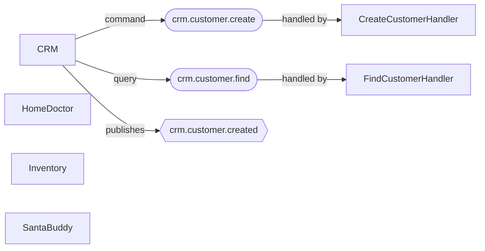

# NorthPole Runtime Graph

Generated from the live NorthPole runtime metadata.

```mermaid
flowchart LR
    node_be95f742db817eeb["CRM"]
    node_87f3947a00bea823["HomeDoctor"]
    node_0c7af4f891d9a3e4["Inventory"]
    node_11ae0921a96f1c19["SantaBuddy"]
    node_8faafe51d14198d8(["crm.customer.create"])
    node_22745398dbd4b6f3["CreateCustomerHandler"]
    node_be95f742db817eeb -->|command| node_8faafe51d14198d8
    node_8faafe51d14198d8 -->|handled by| node_22745398dbd4b6f3
    node_7ab6163ba6bcb383(["crm.customer.find"])
    node_e9b884f4499304f2["FindCustomerHandler"]
    node_be95f742db817eeb -->|query| node_7ab6163ba6bcb383
    node_7ab6163ba6bcb383 -->|handled by| node_e9b884f4499304f2
    node_f8786f77146e9b35{{"crm.customer.created"}}
    node_be95f742db817eeb -->|publishes| node_f8786f77146e9b35
```
